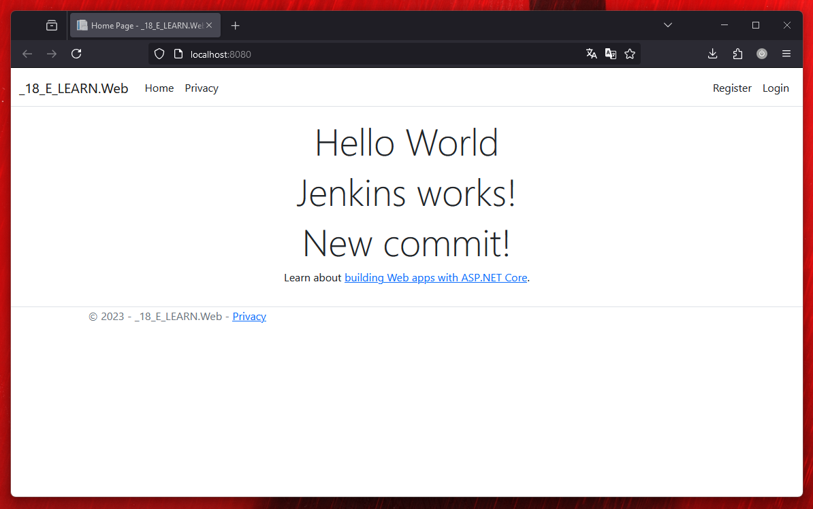

# 18_E_LEARN



### Prerequisites

Install Docker:

```sh
# Ubuntu/Debian using snap
snap install docker
# Verify installation
docker --version
```

Pull required Docker images:

```sh
# Pull .NET SDK
docker pull mcr.microsoft.com/dotnet/sdk:7.0
# Pull .NET ASP.NET Runtime
docker pull mcr.microsoft.com/dotnet/aspnet:7.0
# Pull MS SQL Server
docker pull mcr.microsoft.com/mssql/server:2022-latest
# Pull BuildKit
docker pull moby/buildkit:buildx-stable-1
```

### RUN

1. Step `docker compose --profile sql-only up -d` - Start MSSQL for migrations (first run).
2. Step `docker buildx create --name web-builder --driver docker-container --driver-opt network=18_e_learn_web-network --use` - Create buildx instance for building with network support.
3. Step `docker buildx build -t voutuk/18_e_learn-master-web:latest --builder web-builder --load -f Dockerfile .` - Build using the newly created builder
4. Step `docker compose --profile full up -d` - Launch the project

For subsequent runs, you can use only Step 3 for building and Step 4 to start services.

Available profiles: `sql-only`, `full`, `web-only`

List builders: `docker builder ls` or `docker buildx ls`

Builder full log output: 
```sh
docker buildx build -t voutuk/18_e_learn-master-web:latest --builder web-builder --load -f Dockerfile . --no-cache --progress=plain
```

### Development

Connect to MSSQL [this file **DefaultConnection** string](./18_E_LEARN/18_E_LEARN.Web/appsettings.json#3):

```sh 
host.docker.internal (Windows) or 172.20.0.10 (linux)
```

Without certificate: TrustServerCertificate=False
With certificate: TrustServerCertificate=True

`Server=172.20.0.10` - mssql static ip [docker-compose.yaml](./18_E_LEARN/docker-compose.yaml#37)
### Get cert

[Use folder](./18_E_LEARN/certificates)

> [!CAUTION]
> FIX ALL Cert

### Microsoft

[Add Database Certificate - Microsoft Learn](https://learn.microsoft.com/en-us/sql/linux/sql-server-linux-docker-container-security?view=sql-server-ver16#encrypt-connections-to-sql-server-linux-containers)


