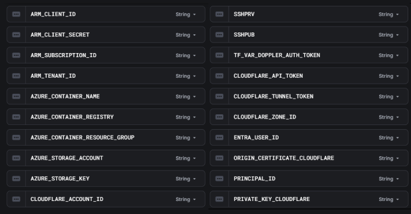

[18_E_LEARN README](./apps/18_E_LEARN/README.md)

# Deployment Documentation

This document provides step-by-step instructions for deploying the application infrastructure using Terraform, Kubernetes, and related tools.

## Table of Contents

- Prerequisites
- Terraform Infrastructure Setup
- Database Backups Restoration
- Kubernetes Deployment
- DNS Configuration

## Prerequisites

Before starting, ensure you have the following tools installed:

- Terraform
- Terragrunt
- Doppler CLI
- Azure CLI
- kubectl
- Helm
- Yarn



## Terraform Infrastructure Setup
1. Configure Variables

First, fill in the correct data in the variables file located in infra/Terraform/variables.tf.

2. Authenticate with Doppler

```bash
doppler login
```

3. Set Up Doppler Project

```bash
doppler setup
```

Select the appropriate branch for your environment (e.g., dev). Make sure the following Azure credentials are available in Doppler:

- ARM_CLIENT_ID
- ARM_CLIENT_SECRET
- ARM_SUBSCRIPTION_ID
- ARM_TENANT_ID

[Check all Prerequisites](#Prerequisites)

4. Azure Role Assignment

Run the following command in Azure CloudShell:
bash

```bash 
az role assignment create \
  --assignee <ARM_CLIENT_ID> \
  --role "Contributor" \
  --scope /subscriptions/<60607c7e-f673-4165-bc74-f250ab1704fc>
```

5. Initialize Storage Account (terragrunt state)
```bash
yarn pre
```

This command runs `terraform init && doppler run -- terraform apply -target=module.sa -auto-approve` behind the scenes.

6. Deploy Core Infrastructure

Before proceeding with the infrastructure deployment, ensure all secrets are available in Doppler.

Initialize Terragrunt:

```bash
yarn init
```

This runs `doppler run -- terragrunt init -migrate-state -force-copy`.

Apply the Terraform configuration:
```bash
yarn apply
```
This executes `doppler run -- terragrunt apply -auto-approve -target=module.ci -target=module.aks -target=module.aks-onix -target=module.network -target=module.acr`.

## Backups Restoration

To restore backups:

1. Stop the Azure Container Instance
2. Copy the backup to the SMB folder
3. Commit the new automatically generated Jenkinsfile with the correct data
4. Run the pipeline which will automatically build the projects

## Kubernetes Deployment

1. Configure Kubernetes Cluster

Navigate to the Kube directory and run:
```bash
yarn pre
```
This executes the get-aks.sh script, which:

Configures kubectl with your cluster credentials
May take some time due to the following operations:
```bash
doppler run -- bash -c 'az aks update -n gosell-aks -g gosell-aks-cluster --attach-acr "$AZURE_CONTAINER_REGISTRY"'
doppler run -- bash -c 'az aks update -n onix-aks -g gosell-aks-cluster --attach-acr "$AZURE_CONTAINER_REGISTRY"'
```

Answer y to all prompts to ensure the cluster data is written to the kubectl configuration.

2. Deploy Applications

Deploy to the GoSell cluster:
```bash
yarn helm:deploy
```

Deploy to the Onix cluster:
```bash
yarn onix:deploy
```

3. Wait for Health Checks

After deployment, wait for the successful health checks:

> Backend services with database migrations take approximately 5 minutes to become ready
> Onyx services become available almost immediately due to the absence of database migrations

## DNS Configuration

After the deployments are complete and the ingress controllers are up, run:
```bash
yarn apply:ingress:olx
yarn apply:ingress:onix
```

These commands create Cloudflare DNS records for your services.

### Verification

Monitor the health status of your services to ensure everything is running correctly before directing traffic to the application.